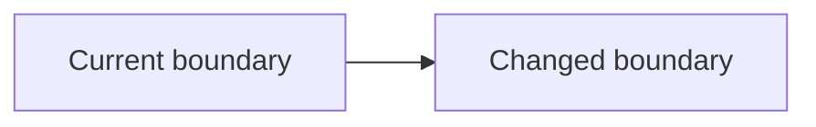

## Context

Describe the existing boundary and constraints.

## Goals and non-goals

List the intended outcomes and explicit exclusions.

## Architecture

## Decisions

Record important choices and link an ADR for durable cross-cutting decisions.

## Risks and mitigations

Record failure modes and mitigations.

## Migration and rollout

Describe compatibility, data migration, rollout, and rollback.

## Validation

Describe deterministic tests, builds, dogfooding, and production evidence.
