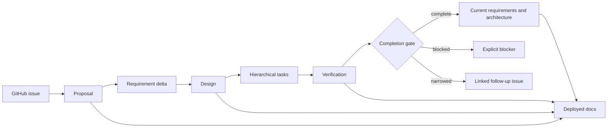

The documentation system separates current truth from proposed work while keeping both
reviewable in the same deployed application.



## Ownership boundaries

- Current requirement pages state only supported behavior.
- Active change pages state proposed, in-progress, or blocked behavior.
- Architecture pages describe implemented structure and link the decisions that explain it.
- Change designs describe the intended architecture for one change.
- The validator proves document structure and reconciliation fields.
- Tests and recorded evidence prove implementation behavior.
- Human review decides whether the evidence is semantically sufficient.

## Completion invariant

```text
Change complete
=> every required in-scope task is complete
=> every completed leaf task has evidence
=> requirements, design, docs, tests, and issue commitments are reconciled
```

Structural validation intentionally does not infer implementation correctness from a
checked box.
