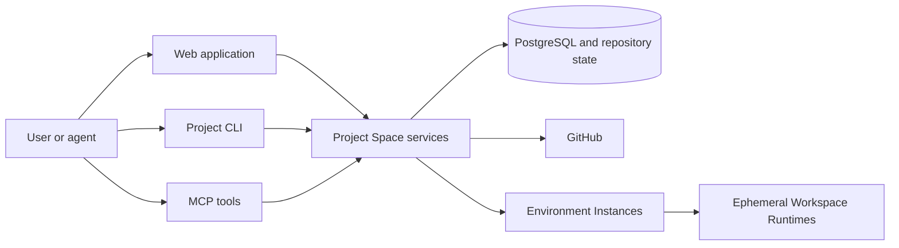

Project Space exposes the same project and execution model through the web application,
the CLI, and MCP tools. Product services own policy and state transitions; adapters connect
those services to GitHub, private-network compute, storage, and runtime processes.

## Architecture guides

- [Remote development](/docs/environments/architecture) explains Platforms, optional Hosts, Environment Instances, SSH control, and Workspace Runtimes.
- [Documentation system](/docs/architecture/documentation-system) explains how requirements, designs, implementation evidence, and deployed docs remain connected.
- [Design decisions](/docs/decisions) record why durable choices were made.

Detailed legacy architecture files are being migrated into this deployed structure as
their owning features change. Until then, this page is the stable map and each detailed
page identifies its authoritative source.
