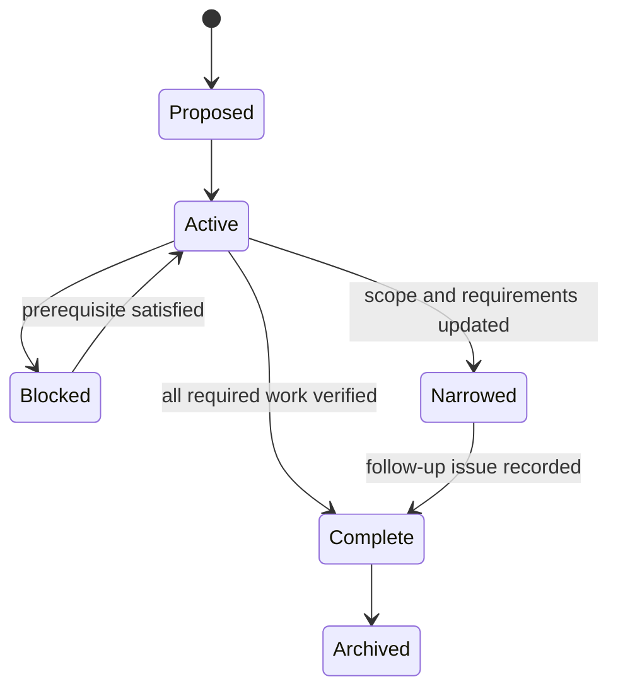

The Project Space format takes current/delta requirement separation from OpenSpec and the
implementation checklist discipline from Kiro. It remains ordinary Markdown and follows
the repository's existing issue, pull-request, and exact-revision delivery gates.

## Proposal

Records the problem, intended outcome, scope, linked issue, kind of change, and whether
requirements are affected. A `Not applicable` requirement declaration needs a concrete
rationale.

## Requirement delta

Uses these operations:

- `ADDED Requirements` for new behavior.
- `CHANGED Requirements` for a complete replacement of existing behavior.
- `REMOVED Requirements` for behavior that will no longer be supported, including migration impact.
- `Not applicable` only for a justified change with no observable behavior change.

Each requirement uses normative language and at least one Given/When/Then scenario.

## Design

Records context, goals and non-goals, architecture or data/control-flow diagrams, important
decisions, risks, rollout or migration impact, and the validation strategy. Cross-cutting
durable decisions also receive an ADR.

## Tasks

Uses Markdown headings and nested checkboxes. Number major sections and important tasks,
but do not assign global identifiers to every checklist item. Completion is derived from
all required descendants.

## Verification

Records requirement-by-requirement evidence and a final checklist covering requirements,
design, tasks, tests, deployed docs, and issue/PR commitments. Its status is `Incomplete`
until every required item is reconciled.

## Lifecycle

An archive preserves the change history. Current requirement and architecture pages remain
the source for supported behavior after completion.
