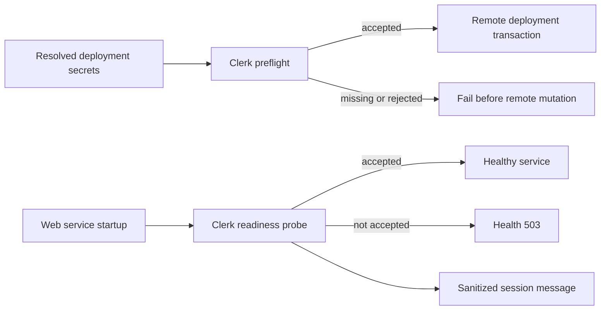

## Context

The deployment transaction already resolves runtime secrets before generating or
executing its remote script, but it previously treated every non-empty Clerk value as
valid. The web service health endpoint only proved that the HTTP process answered. Clerk
token verification failures were collapsed into the same unauthenticated result used for
ordinary rejected sessions.

## Goals and non-goals

Goals:

- Stop invalid Clerk credentials before any remote mutation.
- Make broken authentication visible to container, deployment, and origin health checks.
- Keep the sign-in document reachable so users receive a useful, safe diagnostic.
- Ensure logs and errors never contain credentials or Clerk response bodies.

Non-goals:

- Replace the secret provider in this pull request.
- Add new authorization policy or user roles.
- Make every transient Clerk outage look like a valid deployment.
- Diagnose unrelated GitHub repository access failures.

## Architecture

The CLI validates the exact secret value already resolved for the deployment. The web
entry point performs the equivalent probe once at startup and passes an immutable
readiness result into the HTTP router. Public static content and the session endpoint stay
available, while the health endpoint returns 503 until a correctly configured process is
started.

## Decisions

1. Probe Clerk's backend users endpoint with a one-record limit because it requires the same backend credential used for user lookup.
2. Treat only a successful Clerk response as deployment-ready; rejected and unavailable validation fail closed.
3. Run the CLI preflight after local secret resolution and immediately before the remote transaction.
4. Keep runtime readiness immutable for the process lifetime because deployed environment variables change through container replacement.
5. Expose only a stable user-facing message and a bounded internal reason code; discard upstream response bodies.
6. Keep test-created HTTP servers ready by default and inject explicit readiness states for deterministic integration tests.

## Risks and mitigations

- **A transient Clerk outage blocks a deployment:** failing closed preserves the last verified Production revision instead of activating unverified authentication.
- **The sign-in page becomes unreachable with the health failure:** the process continues serving static content and the session diagnostic while health remains 503.
- **A diagnostic leaks a credential:** errors never interpolate the secret and tests assert that neither the secret nor upstream body appears.
- **Preview authentication is incorrectly probed:** authentication-disabled and trusted Preview runtimes bypass the production Clerk readiness probe.

## Migration and rollout

No stored data changes. Existing healthy credentials continue through the normal path.
An invalid credential now stops before remote mutation, and a container started outside
the CLI remains unhealthy. Rollback restores the previous CLI and server behavior without
changing secret values.

## Validation

- Unit-test accepted, rejected, and missing deployment credentials with an isolated Clerk endpoint.
- Exercise the real HTTP router with rejected readiness and verify health 503 plus the sanitized session response.
- Run the complete Project CLI tests, TypeScript checks, web production build, docs validation, and docs build.
- Start the built app with an invalid test credential and confirm that the sign-in document remains reachable while health fails.
- After approved delivery, verify the exact VPS commit, container health, Clerk acceptance, authenticated login, and unauthenticated denial.
