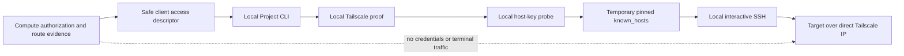

## Context

Compute already records project-scoped private-network evidence, but a server relay would turn
the control plane into a credential and terminal transport. The client therefore receives only
safe launch metadata and performs every network and SSH operation locally.

## Goals and non-goals

Goals:

- Keep exact direct Tailscale IPs canonical; DNS is not a readiness dependency.
- Bind launch metadata to the fresh route, target identity revision, and project Environment.
- Make local, tailnet, target, SSH, host-key, authentication, and Codex states observable.
- Prove allowed local/remote access and blocked non-tailnet and stale paths.

Non-goals:

- SSH relay, browser terminal, server-held credentials, agent forwarding, or arbitrary command
  execution by Project Space.
- Inferring readiness from a provider API, MagicDNS, or an ordinary DNS alias.
- Replacing the provider-native or connector access paths owned by other issues.

## Architecture

## Decisions

1. Publish only exact address, port, user, verified host-key fingerprint, and opaque target
   identity revision; do not publish credentials, sockets, commands, or terminal data.
2. Emit launch metadata only for a ready `ssh_private_network` Tailscale route with complete
   evidence. Stale and unavailable routes remain visible but have no launch metadata.
3. Require local `tailscale status --json` to report `Running` and a local `100.x` address before
   probing the target.
4. Probe the exact IP with `ssh-keyscan`, compare the SHA-256 fingerprint, and use a temporary
   `0600` known-hosts file with strict checking for the interactive SSH process.
5. Keep `codex_unavailable` in the shared contract for #726, while this CLI currently owns the
   local SSH phases.
6. Treat #763 candidate `9b952664fc6c4d519b15cea168157f513469d8a9` as an explicit dispatch/runtime
   assumption only; reconcile with its exact landed contract before merge-ready status.

## Risks and mitigations

- **Server relay drift:** the client bridge has no server transport dependency and tests inspect the
  exact direct SSH arguments.
- **Stale or spoofed route:** the server emits metadata only for fresh ready evidence and the Go
  client rejects non-Tailscale addresses and malformed metadata.
- **Host impersonation:** a live key probe must match the verified fingerprint before SSH starts.
- **Ambiguous target selection:** only one highest-priority verified route is accepted.
- **Local environment failures:** typed phase/code failures distinguish missing tools, offline
  Tailscale, target reachability, SSH, and host-key problems.
- **Contract drift in #763:** the change specification and handoff explicitly keep reconciliation
  open until the exact dependency revision is landed.

## Migration and rollout

The descriptor is additive and preserves existing inventory consumers. The UI only enables its
copy action when a fresh client route is present. No server deployment or data migration is part
of this change; merge readiness depends on the #763 contract reconciliation.

## Validation

- Focused Go tests cover direct allowed access, missing local Tailscale, non-tailnet blocking,
  stale routes, host-key mismatch, authentication, and target failures.
- Compute inventory tests cover exact IP/host-key projection, opaque identity, and privacy.
- TypeScript build and changed UI/model tests cover the command and availability state.
- Full Go tests, CLI documentation checks, and change-spec validation are run before handoff.
