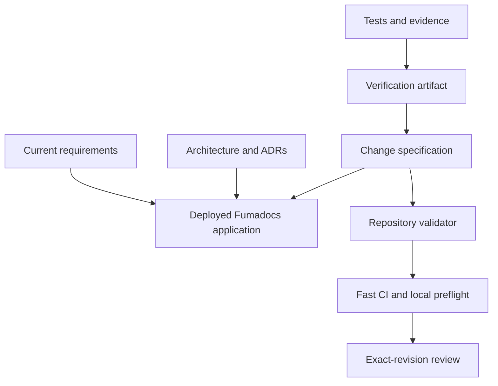

## Context

The Fumadocs application already deploys setup, generated CLI material, API/MCP pages, and
release history. Repository-root architecture Markdown is not consistently included in the
deployed navigation, and no repository-owned validator connects requirements, change
tasks, blockers, and evidence.

## Goals and non-goals

Goals:

- Make the deployed docs the navigable canonical knowledge base.
- Keep current truth visibly separate from proposals.
- Keep checklists natural to read and capable of nesting.
- Fail early on missing artifacts, invalid requirement scenarios, hidden incomplete work, and unsupported blocker/follow-up declarations.

Non-goals:

- Infer semantic code correctness from Markdown.
- Introduce a second issue tracker or delivery gate.
- Require a full change spec for a trivial wording correction.

## Architecture

The canonical content stays under `apps/docs/content`. Current pages and active change
artifacts are rendered directly, avoiding a second committed copy. Templates live beside
the docs content and are validated separately.

## Decisions

1. Use five ordinary Markdown/MDX artifacts instead of adopting OpenSpec commands or Kiro's complete workflow.
2. Use requirement identifiers but only light local decimal numbering for important tasks.
3. Derive parent completion from nested checkboxes and require evidence only for completed leaves.
4. Allow active changes to contain valid open or blocked tasks; completed changes may contain open tasks only under `Deferred follow-ups` with a continuation issue.
5. Run structural validation in every CI execution and retain docs type-check/build as separate proof.

These durable choices are recorded in [ADR-0001](/docs/decisions/0001-canonical-deployed-docs) and [ADR-0002](/docs/decisions/0002-change-spec-workflow).

## Risks and mitigations

- **Checklist parsing becomes too clever:** keep the syntax small, publish examples, and test failures with exact messages.
- **Passing CI creates false confidence:** the validator explicitly labels its result structural and verification requires external evidence.
- **Proposals are mistaken for current behavior:** change indexes and proposal pages show their state; current requirements remain separate.
- **Documentation becomes burdensome:** documentation-only corrections remain direct, while no-behavior refactors can declare requirements not applicable with a rationale.

## Migration and rollout

Existing root architecture documents remain available while their owning areas migrate.
New or changed observable behavior follows the workflow immediately after this change is
merged. The initial current requirement set covers the documentation system itself and
expands incrementally with feature work.

## Validation

- Unit-test artifact, requirement, hierarchy, evidence, blocker, and follow-up rules.
- Validate the checked-in template and this representative change.
- Type-check and production-build the docs application.
- Render Mermaid diagrams during the production build.
- Dogfood navigation and diagrams at desktop and narrow widths.
- Run the repository preflight on the exact clean pull-request revision.
