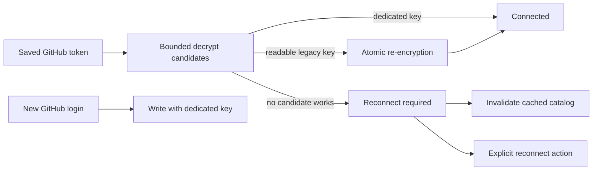

## Context

GitHub OAuth tokens are private, per-user Production data. Their encryption previously
fell back to a credential owned by the Clerk authentication boundary. That coupling made
an unrelated Clerk repair change the key used for database decryption.

## Goals and non-goals

Goals:

- Keep GitHub token storage independent from Clerk rotations.
- Preserve readable legacy records without a bulk migration.
- Fail closed and provide an actionable reconnect path for unreadable records.
- Remove stale connected evidence after authentication loss.
- Keep errors and logs free of token, key, and raw crypto details.

Non-goals:

- Brute-force or otherwise recover data without its former key.
- Introduce another general-purpose application secret.
- Broaden GitHub access or bypass the signed-in user's OAuth flow.

## Architecture

The token store owns database reads, writes, and migration. The encryption module derives
an AES-256-GCM key only from explicit candidates: the dedicated key first, followed by the
current Clerk credential and database URL solely as bounded legacy readers. New writes
always use the dedicated key when it is configured.

## Decisions

1. Require at least 32 characters for the dedicated source before deriving its fixed-size key.
2. Never log or return the failing cipher input, provider token, configured source, or OpenSSL error.
3. Rewrite only when the encrypted fields still match the row that was read, so concurrent updates are not overwritten.
4. Treat migration writes as best-effort after successful decryption; a temporary write failure must not discard a usable connection.
5. Treat cache deletion as best-effort for availability, but never let a deletion failure restore stale connected data in the current response.
6. Carry an explicit reconnect-required flag to the interface instead of inferring the action from error text.

## Risks and mitigations

- **A legacy source is no longer available:** the user reconnects GitHub and replaces only that user's unreadable record.
- **A cache database call fails:** the response stays reconnect-required and does not reuse stale connected data.
- **The dedicated key is weak or absent:** configuration validation rejects a weak value, and Production logs a bounded readiness warning until the approved key is supplied.
- **Two requests migrate at once:** the optimistic encrypted-field match prevents an older read from overwriting a newer token.

## Migration and rollout

There is no schema migration. Readable legacy rows migrate lazily. The currently affected
Production row cannot be recovered without its old Clerk key, so final recovery uses a
new GitHub device login after the independent key is available through Infisical.

## Validation

- Test dedicated-key reads across Clerk and database credential rotation.
- Test readable legacy migration and decrypt the rewritten row using only the dedicated key.
- Test unreadable rows, weak configuration, safe logging boundaries, and new writes.
- Test stale catalog invalidation, including an invalidation failure.
- Exercise the visible reconnect presentation and complete the real Production reconnect after approved delivery.
