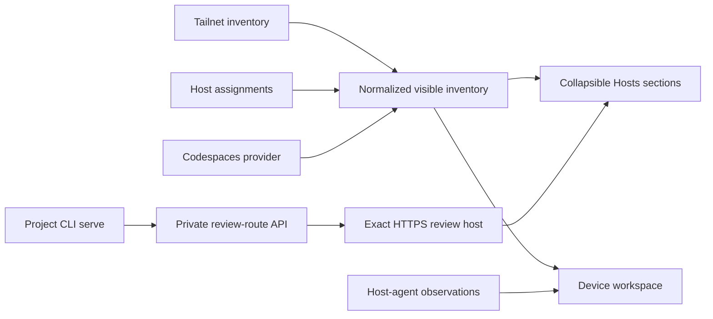

## Context

Tailnet devices are provider observations. A Host is the owner-managed representation of one
physical machine and groups one or more explicitly assigned devices. GitHub Codespaces remain
provider-managed resources rather than fabricated Hosts. Host-agent observations are optional live
evidence and do not redefine Tailnet connectivity.

## Goals and non-goals

Goals:

- Keep the page compact, list-oriented, searchable, sortable, and responsive.
- Make Host membership explicit and reversible.
- Preserve source-specific facts instead of collapsing them into one generic status.
- Reuse DotNaos UI package boundaries and promote generic gaps through project-neutral modules.
- Make Project CLI the only owner of private review-route startup and cleanup.

Non-goals:

- Automatically merge devices by display-name similarity.
- Model Codespaces as physical machines.
- Add server-originated SSH, terminal, remote desktop, or arbitrary commands.
- Duplicate private DNS, TLS, or proxy infrastructure inside Project Space.

## Architecture

## Decisions

1. A discovered supported device remains available until the owner assigns it to a Host.
2. Unsupported device classes are excluded by default but remain observable in a collapsible section.
3. Search, filters, sorting, counts, loading, empty, and error states share one normalized model.
4. Assignment uses a right-side drawer so the list remains visible and the form has stable space.
5. Host-agent telemetry is displayed only from a real observation; absent evidence is labelled plainly.
6. Generic local UI boundaries use DotNaos design tokens and APIs suitable for later package promotion.
7. Project CLI allows only its exact returned review hostname and owns lease renewal and cleanup.

## Risks and mitigations

- **Duplicate machine representation:** normalized identities and explicit assignment prevent one resource from appearing in competing sections.
- **Incorrect availability:** connectivity and telemetry are rendered independently.
- **Unsupported devices dominating the page:** they are excluded by default but never hidden from observability.
- **Drawer styling escaping the theme:** the overlay is rendered inside the DotNaos token boundary and tested for opaque surfaces.
- **Stale private routes:** bounded heartbeats and idempotent stop cleanup remove abandoned routes.
- **Mobile overflow:** the shared hierarchy uses responsive rows and bounded metric charts.

## Migration and rollout

The assignment migration adds owner-scoped Host membership without deleting provider inventory.
Unassigned supported devices appear in the available section until explicitly grouped. Review route
state is ephemeral and can be safely recreated by Project CLI. Rollback removes the new UI and
managed route use without changing Tailnet devices or provider-managed Codespaces.

## Validation

- Run focused inventory-model, assignment-store, drawer, metric, routing, and UI tests first.
- Run TypeScript, UI-copy, Go, Rust, and changed-path quality checks after the interaction stabilizes.
- Dogfood the authenticated private HTTPS review with live provider inventory.
- Inspect desktop and mobile layouts, assignment focus behavior, counts, filters, sorting, and device details.
- Keep merge and production verification separate from this user-owned review checkpoint.
