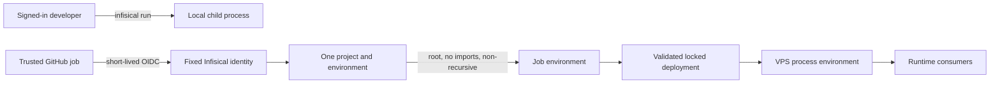

## Context

Secret consumers span a human development session, three GitHub delivery workloads,
the validated Project deployment plan, and server-side runtime consumers. They have
different owners and consequences, so one shared identity would erase attribution and
increase the impact of a compromised workflow.

## Goals and non-goals

Goals:

- Make every secret consumer and owner explainable.
- Keep secret values transient and out of files, logs, command arguments, and artifacts.
- Use short-lived GitHub OIDC instead of repository-stored service credentials.
- Make legacy 1Password runtime references fail closed.
- Preserve exact-revision approval, deployment locking, rollback, and health gates.

Non-goals:

- Build a workflow that provisions credentials automatically.
- Replace personal password, SSH, or sudo use outside development automation.
- Give Production a global GitHub credential.
- Merge, release, or deploy without the existing exact-head approval gate.

## Architecture

The Preview, Production, and release-signing jobs each use their own identity and project.
The action exports environment variables only for the job lifetime. The Project CLI
resolves named values before remote execution, while server-side consumers read only the
process environment. No request path invokes a credential-manager subprocess.

## Decisions

1. Use separate Infisical projects because the current hosted plan does not provide the
   custom roles needed to express all ownership boundaries in one project.
2. Bind GitHub OIDC to exact repository and protected-environment subjects and keep token
   lifetimes short.
3. Pin the official Infisical action to a full commit and spell out export type, root path,
   imported-secret exclusion, and non-recursive scope instead of relying on defaults.
4. Keep Production GitHub access user-owned; public release metadata remains anonymous.
5. Migrate legacy SSH credential rows to disabled state instead of guessing replacements.
6. Keep the VPS workload credential unprovisioned until a separate approved operator
   action can establish its authentication without unattended credential creation.

## Risks and mitigations

- **A workflow receives unrelated values:** explicit path, import, and recursion settings
  plus parsed-workflow regression tests keep the export set narrow.
- **A legacy deployment reloads retired values:** #755 replaces the 1Password action in
  the normal Preview, Production, and signing workflows; exact-head approval remains
  mandatory before delivery.
- **A secret reaches logs or artifacts:** workflows avoid tracing and value enumeration;
  smoke checks validate names and public derivations only.
- **A stored runtime reference becomes unusable:** the database migration disables it
  visibly and the runtime fails closed instead of spawning 1Password.
- **A broad GitHub credential returns:** deployment contracts and tests reject the global
  token while private operations require the signed-in user's OAuth connection.

## Migration and rollout

Infisical projects and fixed identities are created by an attributable operator outside
repository automation. The trusted non-deploying smoke validates all three GitHub
boundaries on `main`. After exact-head approval, #755 merges and the normal locked
Production flow must verify the deployed commit, version, health, Clerk acceptance,
reachable origin, and rollback evidence. Personal 1Password data remains untouched.

## Validation

- Parse and inspect every secret-loading workflow and reject widened scope.
- Run focused Project CLI, deployment, runtime migration, machine-power, and signing tests.
- Run the complete Bun and Go suites plus type checks, builds, action lint, shell syntax,
  Rust checks, packaging, documentation validation, and exact-diff review.
- Run the protected non-deploying OIDC smoke for Preview, Production, and signing.
- Confirm Production recovery through the locked deployment transaction without exposing
  values and preserve the exact revision approval gate for #755 itself.
