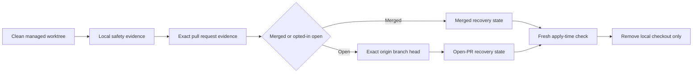

## Context

Worktree purge already separates a read-only plan from an apply operation and rechecks
evidence before deletion. Previously, its GitHub gate mixed merged-PR evidence with Git
ancestry and had no deliberate path for clean work published in an open pull request.

## Goals and non-goals

Goals:

- Make local storage reclamation possible for published work in progress.
- Preserve the exact commit and branch needed to recover the checkout.
- Keep all local activity and cleanliness gates fail closed.
- Make the recovery state visible to people and automation.

Non-goals:

- Treat a local commit, fork, or closed pull request as sufficient recovery evidence.
- Force-delete worktrees, branches, or unknown ignored files.
- Change cleanup behavior unless the new flag is supplied.

## Architecture

## Decisions

1. Use one explicit `--include-open-prs` flag for both single and all-safe purge modes.
2. Allow draft pull requests because the feature deliberately targets work in progress.
3. Require the pull-request head repository to equal the project repository; fork-backed work remains blocked.
4. Require `origin/<branch>` to equal the local head for open pull requests, while allowing merged branches to have been deleted.
5. Rebuild all external evidence immediately before each deletion and retain the exact-head apply fence.
6. Replace the old ancestry shortcut with exact merged-pull-request evidence in default mode.

## Risks and mitigations

- **A commit exists only locally:** cleanliness alone is insufficient; the exact remote branch head is mandatory.
- **A task or process starts after planning:** apply rebuilds fresh Codex, process, Git, and GitHub evidence.
- **A pull request changes state or head:** exact branch and commit evidence is refreshed and mismatches block deletion.
- **Automation cannot explain eligibility:** text and JSON identify `merged` or `open-pr-backed` recovery evidence and the pull request.
- **Unknown local data is hidden by ignore rules:** the existing ignored-data allowlist remains enforced.

## Migration and rollout

No migration is required. Existing invocations keep the stricter default behavior. Rollback
removes the flag and its evidence policy without changing repository or worktree metadata.

## Validation

- Unit-test merged, open, draft, fork, stale-remote, missing-evidence, and batch-refresh paths.
- Run focused Project CLI and project-storage tests plus Go race and vet checks.
- Verify generated CLI documentation.
- Dry-run both modes against a real clean worktree whose exact pull request remains open.
- Require exact-head GitHub checks before merge.
