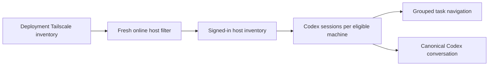

## Context

Project Space already has a canonical Codex session controller and task workspace. Tailscale
inventory is the deployment-owned source of network presence, while Codex task history is
owned by each machine's Workspace Runtime.

## Goals and non-goals

Goals:

- Reuse the complete Codex task experience in the center of Chat.
- Keep machine presence and Codex task truth in their existing ownership boundaries.
- Make the task list compact on desktop and accessible through a drawer on phones.
- Support the normal signed-in local development path without production-only shortcuts.

Non-goals:

- Merge Tailscale and Codex records into a new canonical inventory.
- Depend on MagicDNS or hostnames for readiness.
- Preserve Project Chat as a second graphical conversation surface.

## Architecture

## Decisions

1. Refresh Tailscale before requesting eligible Codex hosts.
2. Match observations to user-owned machine identities while keeping exact Tailscale
   addresses as the network truth.
3. Request sessions only for the machine identifiers returned by the online-host endpoint.
4. Add grouped sections to `@dotnaos/ui` while retaining the existing flat thread API.
5. Use four visible tasks as the default collapsed count for every host.
6. Use the canonical Codex task workspace for conversation, approvals, input, live state,
   continuation, and browser activity.
7. Enable the local app-server transport only when an explicit development machine is set,
   and reject that transport in production.
8. Publish repository, issue, and branch identity with each Project-managed worktree. The
   general Chat dialog may select from that host catalogue, while task detail requires one
   unambiguous identity match and fails closed otherwise.
9. In production, serve the signed-in user's stored task list and conversation snapshots when
   no direct host transport exists. Exclude snapshots that a complete host inventory marked
   missing, and keep inspection and mutation fail-closed.
10. Resolve friendly project route aliases through the same canonical repository matcher used
    during route hydration before opening task detail.

## Risks and mitigations

- **Stale host remains visible:** provider failures clear the host list and removed selections.
- **One source impersonates another:** Tailscale controls presence; Codex controls task data.
- **Long task lists dominate the page:** each section collapses after four tasks.
- **Phone navigation crowds the conversation:** the sidebar becomes a bounded drawer.
- **Development transport reaches production:** startup fails closed when production is set.
- **A task starts in another task's worktree:** task-detail creation accepts only one exact
  repository and issue match, additionally checking the branch when available.

## Migration and rollout

No data migration is required. Rollback restores the previous Chat component and removes the
new read-only host endpoint and development transport wiring.

## Validation

- Test the host query against fresh, offline, and stale Tailscale observations.
- Test grouping, four-task collapse, expansion, selection, and the disabled composer.
- Test general host-scoped worktree selection and exact task-detail worktree binding.
- Test stored production task discovery, live-action denial, and friendly task-route aliases.
- Type-check and build Project Space and `@dotnaos/ui`.
- Dogfood desktop and phone layouts with the actual consumer bundle.
- Verify the signed-in local path against live Tailscale and Codex sources.
