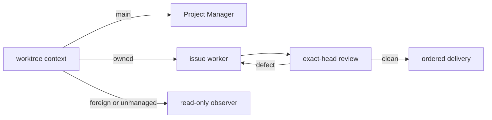

## Context

Project Space already records branch, path, issue, owner, managed, and workspace
metadata in Git worktree configuration. The Manager needs a read-only decision
before any implementation or delivery action.

## Goals and non-goals

Goals:

- Make checkout identity a stable role boundary.
- Keep shared `main` read-only and delivery ownership explicit.
- Preserve useful parallel development while ordering integration and delivery.

Non-goals:

- Mutating or repairing ambiguous checkouts automatically.
- Creating Preview artifacts when the changed surface cannot support one.

## Boundary

The context classifier reads Git worktree paths and worktree-specific ownership
metadata without changing them. Invalid or ambiguous evidence becomes a
non-mutating `unmanaged` result. The Manager skill carries the operational
workflow, while the TASKS template records exact handoff, review, Preview, and
delivery evidence.

## Decisions

1. `main` always routes to the Manager, even when no Codex thread ID is present.
2. A managed worktree is mutable only when its recorded owner equals the current
   task; a different owner is `foreign` and remains read-only.
3. A worker-ready PR is an input to Manager review, never a terminal state.
4. Preview proof is conditional on the changed surface; alternative proof is
   explicit when Preview is not supported.
5. Review corrections reuse the same task and integration/rebase/merge order is
   preserved even when development proceeds against explicit assumptions.
6. Implementation dispatch uses the canonical #763 operation, not a local
   worktree preparation followed by an untracked handoff. The exact candidate
   `f0d7b422` currently lacks model/reasoning and Manager-only reporting fields;
   those remain an explicit merge-readiness dependency.

## Architecture

The CLI reads Git worktree inventory and worktree-specific configuration. It emits
structured context without writing configuration. The skill consumes that output
and records handoff, review, Preview, and delivery evidence in `TASKS.md`.

## Risks and mitigations

- **Ambiguous checkout is mutated:** invalid evidence is classified as
  non-mutating `unmanaged`.
- **Worker PR is mistaken for completion:** the skill requires exact-head review,
  Preview/browser proof, and same-worker correction.
- **Resource fan-out:** the TASKS validator rejects more than three active rows.

## Migration and rollout

No data migration is required. Existing managed worktrees remain valid, including
legacy owned worktrees without a Workspace ID. The new command and skill roll out
with the Project Space plugin.

## Validation

Run ownership Go tests, skill/ledger tests, CLI documentation checks, and docs
specification checks. Dogfood the command against shared `main`, an owned issue
worktree, and a foreign task identity.
