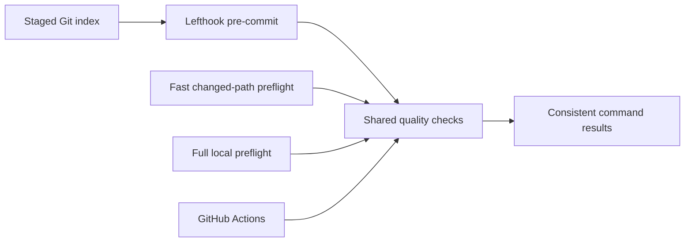

## Context

The repository already has a selective local preflight, but both that script and several
workflows embed their own command lists. The local runner also needs to distinguish a
short feedback loop from an explicit, comprehensive local review. Git linked worktrees
share a hook directory, while the hook executes from the current worktree and reads its
current configuration.

## Goals and non-goals

The goal is one command registry for locally reproducible checks and exact-index fast
feedback before commits. Slow suites remain in preflight and CI, and protected remote
operations are not simulated locally.

## Architecture

## Decisions

- The quality registry owns command arguments and working directories.
- The default preflight selects changed-path extras; the optional full profile selects all locally reproducible Fast CI lanes plus applicable local release-quality checks.
- GitHub release policy remains independent and is included in the local report rather than silently expanding the fast profile.
- The pre-commit profile runs only diff hygiene, package-manager policy, and docs specs.
- Staged validators read blobs from the Git index so unstaged edits cannot hide or cause failures.
- Change-spec coverage compares the pull-request merge base with the planned index snapshot.
- Lefthook installation uses its trusted Bun package lifecycle; no custom hook wrapper is committed.

## Risks and mitigations

Linked worktrees share the installed hook, so the generated wrapper must tolerate branches
without a configuration. Lefthook's default behavior does so; strict installation assertions
are deliberately not enabled. Slow checks are excluded from pre-commit to keep bypass pressure low.

## Migration and rollout

A normal frozen Bun install downloads the pinned Lefthook package and installs the hook.
Existing check names stay available while workflows move to the shared runner. Removing the
dependency and configuration rolls the change back without touching repository data.

## Validation

Focused tests cover command resolution, index-only partial commits, merge-base documentation
coverage, workflow wiring, and local preflight. Lefthook is validated and dogfooded in an
isolated Git repository before the full repository preflight and pull-request CI run.
