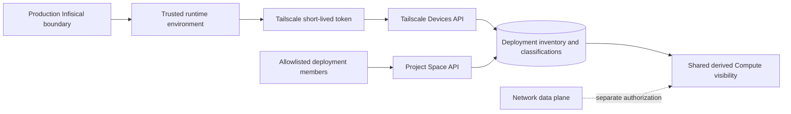

## Context

Project Space is installed once for one person, team, or organization. Its infrastructure
connections belong to that deployment, while users remain individual actors for authentication,
authorization, and audit. Tailscale OAuth inventory is a control-plane API and does not join the
server to a tailnet.

## Goals and non-goals

Goals:

- Express one tailnet connection as deployment configuration.
- Share inventory and classification truth across admitted users.
- Keep membership explicit and fail closed in Production.
- Remove stored long-lived Tailscale credentials from application data.
- Preserve direct-IP truth and sanitized freshness/error states.

Non-goals:

- Build a shared multi-organization SaaS tenant model.
- Authorize remote network operations from OAuth inventory.
- Migrate unrelated historical user-owned resources automatically.
- Give WireGuard Tailscale inventory semantics.

## Architecture

## Decisions

1. Use fixed runtime names `TAILSCALE_OAUTH_CLIENT_ID` and
   `TAILSCALE_OAUTH_CLIENT_SECRET`; browser requests cannot provide replacements.
2. Key Tailscale observations, classifications, refresh coalescing, and projections by one fixed
   internal deployment scope while retaining the authenticated person as the audit actor.
3. Add only that fixed scope to Compute definitions, platforms, Hosts, and Environments; keep
   Connector associations filtered to the authenticated user.
4. Require `PROJECT_SPACE_ALLOWED_EMAILS` in Production and deny every session when it is empty.
5. Revoke and null old provider-connection envelopes instead of guessing that historic user
   credentials belong to the deployment.
6. Keep the old host-local source behind an explicit legacy profile and configured-owner gate.

## Risks and mitigations

- **Unrelated Clerk user sees the tailnet:** Production membership is mandatory and tested empty,
  listed, and unlisted.
- **One member sees another's user-owned provider rows:** only the fixed Tailscale scope is added to
  shared Compute reads; Connector associations keep the requesting user key.
- **Credential remnants survive the cutover:** migration 0056 clears key ID, ciphertext, IV, and
  authentication tag while preserving a revocation audit.
- **Old devices appear after configuration loss:** unusable source states return no cached devices.
- **Host Tailscale becomes an implicit dependency:** normal Compose excludes the socket sidecar;
  the legacy profile is separately named.
- **OAuth access is mistaken for SSH access:** the API grants inventory only and no data-plane route.

## Migration and rollout

Production secret names are provisioned in the existing delete-protected Infisical project before
delivery. Database migration 0056 sanitizes legacy per-user connection rows. The first API refresh
seeds the clean deployment scope; historic per-user observations are not silently moved. Rollback
can return to the previous application revision without restoring cleared credentials.

## Validation

- Test two member identities against one deployment source, storage scope, classification, and audit.
- Verify shared Compute reads include only the fixed deployment scope plus the requesting user.
- Test current and legacy connectivity fields, all-invalid payloads, revoked credentials, and stale denial.
- Parse deployment workflow and Compose contracts and verify Infisical names before VPS contact.
- Run the complete repository preflight and browser dogfood before requesting exact-head approval.
