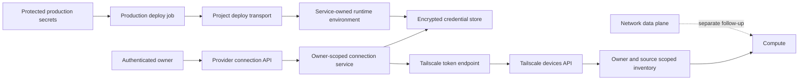

## Context

Project Space first proved real Tailscale inventory through a fixed adapter reading the production
host's local daemon. The durable control plane must work without host Tailscale state, represent
different users' tailnets independently, and keep provider credentials outside browser-visible data.

## Goals and non-goals

Goals:

- Bind provider credentials and inventory to the authenticated Project Space owner.
- Use Tailscale's supported least-privilege OAuth client-credentials API model.
- Keep exact IP addresses and source identity observable.
- Make missing keys, revoked credentials, stale evidence, and cross-owner access fail closed.
- Preserve the temporary local adapter until real migration evidence exists.

Non-goals:

- Join the shared server to customer tailnets.
- Add SSH, ping, terminal, relay, or arbitrary command capability.
- Define Tailscale OAuth as provider identity for non-Tailscale environments.
- Model WireGuard as if it had Tailscale device-inventory semantics.

## Architecture

## Decisions

1. Use one Tailscale client-credentials connection per Project Space account because Tailscale's
   supported OAuth API model is tailnet-scoped rather than an interactive end-user login flow.
2. Request only `devices:core:read`; inventory access grants no network or remote-command ability.
3. Encrypt client credentials at rest with a versioned deployment key and keep access tokens in memory.
4. Key all connection and inventory reads by authenticated owner, with no caller-supplied owner override.
5. Publish exact device IPs and explicit provider/source metadata; MagicDNS remains optional.
6. Cache only bounded, source-scoped inventory evidence and preserve safe failure information.
7. Keep the VPS-local adapter explicitly named and available only for its configured migration owner.
8. Pass the encryption key from the protected deployment job through the existing pinned SSH/stdin
   deployment path; the VPS cannot retrieve GitHub secret plaintext itself.

## Risks and mitigations

- **Cross-tenant device disclosure:** storage, service, cache, and API access are all owner-scoped and tested with two owners.
- **Credential disclosure:** credentials are encrypted at rest, never returned by APIs, and provider errors are normalized.
- **Revoked or invalid credentials:** token exchange failures produce a safe unavailable state without fallback inventory.
- **Stale inventory:** refresh metadata records source, revision, freshness, and provider availability.
- **Missing or incorrect encryption key:** startup and credential reads fail closed instead of inventing or bypassing a connection.
- **Secret delivery through logs or arguments:** only the protected deploy step receives values and writes them through the existing stdin-fed runtime environment path.
- **Implicit dependence on host Tailscale:** the provider runtime is exercised without a Tailscale socket; the legacy adapter remains separately identified.

## Migration and rollout

The database migration adds encrypted provider-connection storage without removing existing compute
records or devices. Production keeps the local adapter while the owner connects a real Tailscale
OAuth client and verifies fresh inventory. Disconnecting deletes only Project Space's provider
connection and cached inventory, never a Tailscale device, machine, deployment target, or provider
resource. Rollback stops using account connections while leaving the temporary adapter intact.

The credential-encryption key must remain stable across deployment-secret-provider migration. A
deliberate rotation must re-encrypt stored credentials before retiring the old key.

## Validation

- Exercise two isolated owners through connection, inventory, failure, and disconnection tests.
- Verify revoked credentials and missing/wrong encryption keys fail closed without raw output.
- Run provider, API, storage, deployment, UI, and canonical repository checks.
- Exercise the exact production container set without a Tailscale socket or daemon dependency.
- Dogfood the connection UI with representative inventory and verify explicit provider/source labels.
- After approved merge, connect a real production OAuth client and verify fresh inventory before retiring the temporary adapter.
