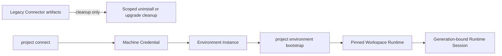

# Connector retirement

The permanent Project Space Connector has been retired. This is an immediate
product boundary: there is no 30-day compatibility window and no new permanent
Connector installation path.

The valid path starts from an exact Environment Instance and launches a pinned
Workspace Runtime. The invalid path is any attempt to install, enroll, start,
or route work through a permanent Connector. `project connect` remains valid:
it enrolls only the owner-bound Machine Credential used for authenticated
control requests. Enforcement belongs at the
bootstrap and runtime boundaries, so a stale Connector executable cannot
bypass the canonical Environment and Workspace identity checks.

## Canonical replacements

| Retired responsibility | Canonical owner |
| --- | --- |
| CLI authentication | Owner-bound Machine Credential from `project connect` |
| Environment identity | Environment bootstrap and immutable Environment Instance identity |
| Codex version and launch | Pinned Workspace Runtime manifest and Project CLI launch |
| Codex streaming and steering | Outbound Workspace Runtime and Codex App Server channels |
| Project and worktree operations | Project CLI against the exact managed Workspace |
| Development-server lifecycle | Workspace Runtime lifecycle and typed runtime events |
| Resource reporting | Workspace Runtime telemetry and optional project-hostd |
| Connector self-update | Explicit Project CLI update; no background Connector updater |

Use [Compute Platforms, Hosts, and Environments](./compute-environments.md),
[Workspace runtimes](./workspace-runtimes.md), and [Workspace Runtime
sessions](./workspace-runtime-sessions.md) for the active contracts.

## Compatibility and cleanup boundary

- Old Connector binaries, service names, scheduled tasks, LaunchAgents, and
  credentials may be recognized only to remove them safely.
- Cleanup is exact and fail-closed. It must not invoke the retired binary,
  reconnect it, or delete unrelated user-owned files.
- Connector IDs, legacy machine IDs, hostnames, IP addresses, and provider IDs
  are never reinterpreted as Environment, Workspace, or Runtime IDs.
- The signed release manifest remains
  `project-space.connector-runtime-release/v1`; its schema and parser are
  unchanged for installed v0.21.17 clients.

## Removing legacy Compute records

Legacy Connector rows may be removed from Compute only through the dedicated
owner-only cleanup flow. The server first resolves the exact owner-scoped
record and checks every remaining dependency. Active credentials, Host
associations, run destinations, Workspace Runtimes, Codex routes, development
servers, or in-flight work block removal and are named to the owner.

Removal records an immutable, sanitized receipt and suppresses that exact
legacy projection during later reconciliation. It does not delete the
underlying membership or historical evidence. This prevents a refresh from
recreating the row while preserving audit and recovery evidence.

The cleanup transaction never calls Tailscale, SSH, a provider, or a remote
machine. It never deletes or modifies a Tailscale device, physical machine,
provider resource, deployment destination, canonical Environment, credential,
or remote installation. If a Tailscale or provider-backed Environment is
already bound to the same canonical Environment identity, the owner sees that
replacement before confirming removal.

Bulk cleanup uses the same rules for every selected row. Eligible rows can
succeed while blocked or changed rows remain untouched, and repeating a
completed request returns the existing receipt instead of affecting another
resource.
