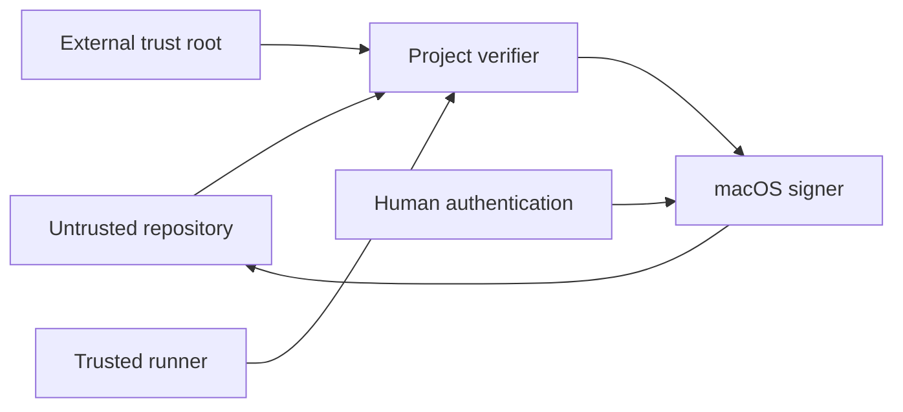

## Executive summary

The primary risk is false approval by an agent that controls every repository file. The design therefore treats the repository as untrusted and anchors authority in a preinstalled verifier, an external read-only trust root, and a Secure Enclave key requiring LocalAuthentication.

## Scope and assumptions

- In scope: `project approval`, policy and sidecar parsing, macOS signing, portable verification, and runner integration.
- The agent may modify, add, or remove every checkout file and execute the repository's programs.
- The agent cannot modify the runner-owned verifier/config or satisfy macOS LocalAuthentication itself.
- Social engineering of a human and compromise of macOS or the external runner are out of scope.

## System model

### Primary components

- Untrusted repository: policy, covered source, and signed sidecars.
- Project CLI verifier: deterministic hashing and pure-Go signature verification.
- macOS signer: Apple-signed CryptoKit helper, Secure Enclave, opaque device-bound key representation, and LocalAuthentication.
- Trusted runner: immutable invocation, verifier artifact, and signer/policy pins outside the checkout.

### Data flows and trust boundaries

- Repository → verifier: YAML policy, source bytes, JSON sidecars; strict schema and confined paths.
- Verifier → macOS signer: a SHA-256 digest and human-readable reason; signing requires system authentication.
- Trusted runner → verifier: external trust root and untrusted checkout path; runner owns both invocation and expected identity.

#### Diagram

## Assets and security objectives

| Asset | Why it matters | Security objective |
|---|---|---|
| Approval truth | Gates agent-produced changes | Integrity |
| Secure Enclave private key | Represents the human approver | Confidentiality, integrity |
| External trust root and verifier | Prevent repository self-authorization | Integrity, availability |
| External latest checkpoint | Prevent deletion, rollback, and replay of signed history | Integrity, availability |
| Covered source digest | Defines what was reviewed | Integrity |

## Attacker model

### Capabilities

The attacker can rewrite policy, source, sidecars, public keys, scripts, workflows, and repository-built binaries; copy or replay old attestations; and request an authentication prompt.

### Non-capabilities

The attacker cannot export the Secure Enclave key, complete LocalAuthentication without the owner, or modify or roll back the separately administered runner gate, trust root, and latest checkpoint. The checkpoint guarantee does not hold if the repository agent has equivalent filesystem authority over that external state.

## Entry points and attack surfaces

| Surface | How reached | Trust boundary | Notes | Evidence |
|---|---|---|---|---|
| Policy parser | `--policy` | Repository to verifier | Strict fields and confined paths | `internal/approval/load.go` |
| History parser | policy attestation path | Repository to verifier | Strict JSON, full-chain, and signature checks | `internal/approval/history.go` |
| Checkpoint parser | fixed external path | Trusted bridge to verifier | Strict identity and per-scope tip binding | `internal/approval/checkpoint.go` |
| Native signer | `approval sign/revoke/enroll` | CLI to macOS | Secure Enclave and fresh LocalAuthentication | `internal/approvalsigner/signer_darwin.go` |
| Runner gate | external command | Runner to checkout | Binary/config live outside checkout | `docs/cryptographic-approvals.md` |

## Top abuse paths

1. Replace repository key and forge a signature → external SPKI pin rejects it.
2. Delete a required scope from policy → external policy digest pin rejects it.
3. Edit covered source after approval → recomputed content/file hashes mark it stale.
4. Copy a sidecar to another repository or scope → signed identities mismatch.
5. Remove repository verification scripts → runner-owned invocation still runs and fails closed.
6. Trigger signing programmatically → the system prompt still requires the device owner.
7. Delete history or restore a pre-revocation approval → the external checkpoint reports missing history or replay mismatch.
8. Roll back history and checkpoint together → prevented only by denying the repository agent write/rollback authority over the external checkpoint.

## Threat model table

| Threat ID | Threat source | Prerequisites | Threat action | Impact | Impacted assets | Existing controls | Gaps | Recommended mitigations | Detection ideas | Likelihood | Impact severity | Priority |
|---|---|---|---|---|---|---|---|---|---|---|---|---|
| TM-001 | Repository agent | Checkout write access | Replace key, policy, and signature | False approval | Approval truth | External key and policy pins | Runner compromise remains | Keep verifier/config read-only and integrity-pinned | Log verifier artifact/config digest | High | High | critical |
| TM-002 | Repository agent | Old valid history | Replay approval after signed revocation | False approval | Approval history | Signed event chain plus external checkpoint | External checkpoint rollback authority | Keep checkpoint protected and report exact tip mismatch | Log accepted sequence/event digest | High | High | critical |
| TM-003 | Repository agent | Ability to execute CLI | Request misleading auth prompt | Human approves wrong scope | Human authority | Prompt binds operation, repository, policy, stable scope, digest, sequence, and previous event | Social engineering | Show the same trusted values in review UI | Audit issued time, sequence, and signer | Medium | High | high |
| TM-004 | Local attacker | Same user session | Replace native binary | Capture or alter operation | Approval truth | Runner pins trusted artifact | Developer-local CLI may be mutable | Code-sign releases and verify artifact hash | Record binary signature/hash | Low | High | high |
| TM-005 | Malformed repository | Parser access | Traversal, symlink, or malformed envelope | Wrong bytes verified or denial | Covered source | Strict fields, confinement, symlink rejection | Resource limits are basic | Add runner time/size limits | Log safe parse category | Medium | Medium | medium |

## Criticality calibration

- Critical: repository self-authorizes or extracts the private key.
- High: stale/cross-scope approval passes, or the trusted artifact is replaced.
- Medium: malformed input denies one verification run without bypass.
- Low: cosmetic status ambiguity without changing the exit result.

## Focus paths for security review

| Path | Why it matters | Related Threat IDs |
|---|---|---|
| `internal/approval` | Canonicalization and verification truth | TM-001, TM-002, TM-005 |
| `internal/approvalsigner` | Secure Enclave and auth boundary | TM-003, TM-004 |
| `cmd/project/approval.go` | User and runner command contract | TM-001, TM-003 |
| `cmd/project/validate.go` | Convenience validation integration | TM-001 |

## Quality check

- Covered repository, signer, and runner entry points and every trust boundary.
- Separated production verification, development overlays, CI/runner trust, and tests.
- Recorded the adversarial repository assumption and external enforcement requirement.
- Remaining assumptions are operating-system and runner integrity, not repository controls.
