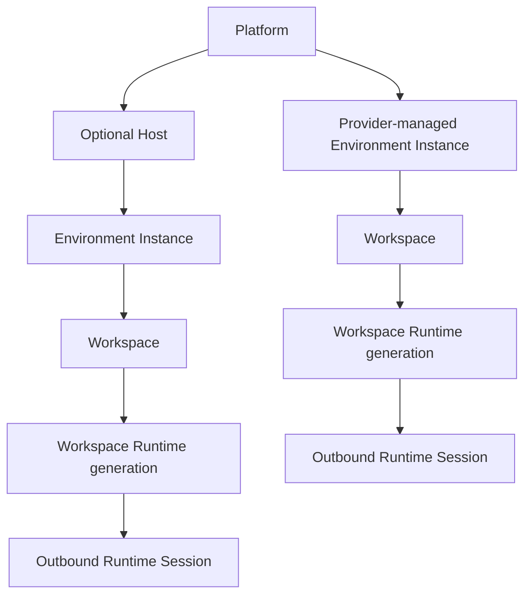
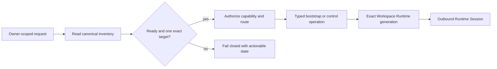
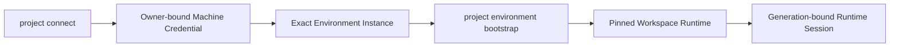

# Remote Development and Compute Control Architecture

## Status

This is the canonical description of the remote-development path shipped by
Project Space. It describes the current contracts on `main`, not a planned
replacement for an older transport. The focused operational documents linked
below remain the source for command details and protocol limits.

The central rule is that inventory identity, access transport, runtime
execution, and out-of-band hardware control are separate concerns. A control
request resolves one owner-scoped target and one authorized capability before
it can reach a route or start work.

## The canonical hierarchy



The normal path is:

```text
Platform
└── optional Host
    └── Environment Instance
        └── Workspace
            └── Workspace Runtime generation
                └── Runtime Session
```

Provider-managed compute starts at the Platform and continues directly to an
Environment Instance. Project Space does not invent a Host when the provider
does not expose one. A GitHub Codespace is therefore a concrete Environment
Instance under the GitHub Codespaces Platform, with `hostResolution:
not_applicable` when that is what the inventory contract reports.

## Domain objects

### Platform

A Platform is a configured source and lifecycle boundary for capacity. It may
provide discovery, provisioning, provider-native lifecycle operations, quotas,
or access routes. Examples include Local devices and GitHub Codespaces.

A Platform is not itself an execution target. The target is the concrete
Environment Instance resolved from that Platform.

### Environment definition

An Environment definition is a reusable catalog entry. It describes the kind
of operating system or provider runtime an instance represents, including its
name, slug, kind, operating-system family, supported architectures, ownership,
and bootstrap strategy.

The definition does not contain current resources, an SSH address, an online
state, a Host association, or running Workspaces. Those values belong to the
concrete Environment Instance.

### Environment Instance

An Environment Instance is one installed or provisioned realization of an
Environment definition. It is the canonical scheduling and remote-control
target. Every instance belongs to exactly one Platform, references exactly one
Environment definition, and has its own lifecycle, access routes, resources,
workspace inventory, and freshness.

Two Windows instances can share the `Windows` definition while remaining
independent targets:

```text
Environment definition: Windows
├── Environment Instance: windows-01
│   ├── Platform: Local devices
│   └── Host: os-pc
└── Environment Instance: windows-02
    ├── Platform: Local devices
    └── Host: os-work-2
```

An instance may have a parent instance for a nested runtime such as WSL. A
short-lived devcontainer created only for one Workspace is normally a
Workspace Runtime, not a new top-level inventory instance.

### Host

A Host is an optional, recognizable physical or virtual device whose total
capacity and host-wide capabilities matter. Host-owned capabilities can
include physical resources, power, and an out-of-band console.

Dual boot is one Host with multiple Environment Instances:

```text
Platform: Local devices
└── Host: os-pc
    ├── Environment Instance: windows-01
    └── Environment Instance: ubuntu-native-01
```

The mutually exclusive operating systems do not duplicate the Host's physical
capacity. A provider-managed instance has no Project Space Host when the
provider hides the underlying device.

### Workspace and Workspace Runtime

A Workspace is the managed project checkout and task state used for
development. A Workspace Runtime is the ephemeral process or container group
for one Workspace and one exact runtime generation. It owns repository
tooling, dependencies, development servers, the runtime supervisor, and the
Codex App Server process when that capability is requested.

The checkout may remain after a runtime stops. Recreating a runtime creates a
new generation and does not mutate the identity of the Environment Instance or
Workspace.

### Runtime Session

A Runtime Session is the live, authenticated outbound connection from one
Workspace Runtime generation to Project Space. It carries bounded lifecycle,
heartbeat, dev-server, log-pointer, and telemetry events. It is not an
inventory object and cannot change its owner, Workspace, Environment Instance,
or generation identity.

## Inventory and automatic selection

The CLI exposes the current inventory contract as schema version 3. It includes
Environment definitions, Platforms, Hosts, Environment Instances, private
networks, resources, workspace summaries, access routes, Host resolution, and
optional `project-hostd` observations. The inventory also returns an explicit
`inventoryState` and any invariant violations; callers must not schedule work
from a conflicted inventory.

Use the shortest current commands first:

```sh
project inventory --format json
project environment list --format json
project environment instance list --format json
project host list --format json
```

The inventory is owner-scoped. Selectors identify the exact Environment
Instance or Host; display names, hostnames, IP addresses, MAC addresses,
Connector records, and mutable container IDs are not identity-merge keys.

### Bootstrap flow

From the managed project Workspace, the supported bootstrap path is automatic:

```sh
project environment bootstrap
```

Project detects the current Workspace, branch, commit, approved runtime plan,
runtime version, launch mode, owner, and an unambiguous Environment Instance.
It creates the generation identity, starts the pinned Workspace Runtime, and
checks the Workspace, Environment Instance, generation, and manifest bindings
before reporting success.

If automatic selection is genuinely ambiguous, inspect the available instances
and then use the explicit instance form:

```sh
project environment instance list
project environment bootstrap <environment-instance>
```

The explicit form is for resolving that ambiguity or for a deliberate
automation. It is not necessary for the normal current-Workspace path.

The separate [Environment bootstrap guide](https://github.com/DotNaos/project-space/blob/main/apps/docs/content/docs/environments/setup.mdx)
documents the supported advanced overrides. They must describe one consistent
Workspace, commit, generation, manifest digest, and runtime version.

### Control-flow boundary



No request may skip the exact target binding by supplying a legacy transport
identifier or by treating a stale runtime as a new Environment Instance.

## Private-network access and typed SSH

SSH is a control transport only through an approved private-network route. The
current inventory contract models private-network providers such as Tailscale
and WireGuard without making either provider a domain identity.

The server-side gateway is a forced-command boundary:

```text
Project Space control plane
    │ owner + target + capability authorization
    ▼
SSH over approved private network
    │ pinned route and host identity
    ▼
dedicated account with project control-gateway --stdio
    │ typed JSON frames only
    ▼
Project CLI on the exact Environment Instance
```

Each control route uses its own gateway key reference. The authorized-key
entry is restricted to the typed gateway command, and the target stores its
Environment identity in a root-owned file with an identity revision. The
gateway rejects a missing, writable, or mismatched identity binding. It never
accepts shell text.

The [SSH control gateway contract](./ssh-control-gateway.md) covers the forced
command, identity installation, gateway identity, and fail-closed checks.

The access route is not a separate machine-like inventory item. It is a
capability of an Environment Instance or Host route with provider, priority,
verification, and policy state.

## Workspace Runtime and outbound sessions

The trusted control plane allocates a runtime generation before dispatch. It
issues one short-lived credential bound to the owner, canonical Workspace ID,
exact Environment Instance, generation, branch, commit, manifest digest,
runtime version, capability set, and expiry. The credential is handed to the
runtime through a protected bootstrap file; it is not placed in arguments,
events, URLs, or browser responses.

The runtime then connects outbound to:

```text
Workspace Runtime
    │ outbound TLS/WebSocket
    ▼
/api/workspace-runtimes/socket
    │ runtime.register with immutable binding evidence
    ▼
Project Space session gateway
```

The first registration frame repeats the owner, Workspace, Environment
Instance, generation, source, manifest, and runtime-version evidence. The
server compares every field with the credential before accepting the session.
Subsequent frames are bounded, typed lifecycle, heartbeat, dev-server,
telemetry, or sanitized log-pointer events with increasing sequence numbers.

The normal heartbeat interval is 15 seconds and the session becomes stale
after 45 seconds without a heartbeat. A stale Runtime Session says only that
the outbound runtime channel is unavailable; it does not prove that the Host
or Environment Instance is offline. Recovery uses typed SSH inspection or the
provider's authorized control route.

See [Workspace Runtime sessions](./workspace-runtime-sessions.md) for the
registration, replay, reconnect, stale-state, and credential contract.

## Codex and development servers

The Project CLI starts the Codex App Server inside the Workspace Runtime when
the requested runtime profile includes Codex. The App Server uses the same
outbound runtime channel after startup; SSH is not held open for the lifetime
of the session.

```text
Typed start request
    ▼
Project CLI
    ▼
Workspace Runtime generation
    ▼
Codex App Server
    │ typed outbound channel
    ▼
Project Space
```

Codex authority is promoted only when the generation-local controller has
started the authenticated App Server and registers the exact ready capability
`runtime.codex.v1` with durable command and event watermarks. A telemetry-only
registration receives no Codex authority. The controller exposes bounded
Codex operations, not shell execution, arbitrary process launch, or file
access.

Development-server lifecycle is also typed. The current runtime-control
contract includes `dev-server.inspect`, `dev-server.start`,
`dev-server.publish`, and `dev-server.stop`. Runtime events carry the server
state, port, runtime generation, and sanitized URL; active state does not
depend on continuous SSH polling.

For direct local runtime inspection, use the current CLI surface:

```sh
project workspace runtime inspect --json
project workspace runtime start --json
project workspace runtime stop --json
```

The [Workspace Runtime guide](./workspace-runtimes.md) remains the operational
reference for exact lifecycle fencing, process/container boundaries, and
retention.

## Optional `project-hostd`

`project-hostd` is optional host-side telemetry. Normal development remains
valid with private-network SSH, the Project CLI, and outbound Workspace Runtime
sessions alone.

The current hostd contract is versioned as schema 1 and protocol 1. A hostd
credential is scoped to a device, Environment Instance, optional Host,
operation, and expiry. Telemetry reports resources and registered runtime
process-group usage with sequence and observation identity. The inventory
surfaces hostd as available, stale, unavailable, or unknown and records
partial metrics explicitly.

Hostd may report:

- CPU, memory, storage, and optional GPU resources;
- the health and freshness of the hostd observation;
- registered Workspace Runtime process-group telemetry;
- bounded Host or Environment metadata that the runtime cannot provide.

Hostd does not provide arbitrary shell execution, repository browsing, Git
operations, Codex control, project-specific configuration, or a public
listener. A telemetry outage makes Host-wide resource evidence stale; it does
not disable the normal SSH and Workspace Runtime path.

See [Host control and telemetry](./host-control.md) and the
[compute inventory model](./compute-environments.md) for the current evidence
and ownership rules.

## Host control and the external JetKVM boundary

Host control targets one canonical Host. It never reinterprets an Environment
definition, Environment Instance, legacy physical-machine identifier, access
route, or JetKVM device ID as a Host.

The Host control contract separates:

- Host capability and power status;
- fresh frame retrieval with frame identity and dimensions;
- typed key, chord, text, mouse-move, and mouse-click operations;
- actor-, Host-, binding-, policy-, and approval-bound audit evidence;
- current-frame and coordinate checks;
- persistent rate limiting and stale-frame handling.

Keyboard, pointer, and forced power operations are at least boot risk because
the server cannot infer whether a frame is a normal login, firmware screen,
recovery environment, or installer. Higher-risk actions require a current
approval and two control-plane authorization decisions: before Host binding
resolution and immediately before dispatch.

The real JetKVM frame/HID adapter is the explicit external follow-up [#643](https://github.com/DotNaos/project-space/issues/643).
Until a supported, authenticated, version-pinned adapter or reviewed local
gateway exists, the frame/HID path remains fail closed. Normal Workspace
development and Runtime startup do not depend on it. No private firmware RPC,
shell route, or browser-held credential substitutes for that missing boundary.

The [Host power and console contract](./host-control.md) is the operational
reference.

## Connector retirement boundary

The permanent Project Space Connector is retired. It is not an installation,
enrollment, credential, command, or execution route for current development.

The supported control flow is:



`project connect` remains the owner-bound machine-credential enrollment path;
it does not install a permanent service. Bootstrap and Runtime validation are
the enforcement boundary, so an old local artifact cannot bypass the canonical
Environment and Workspace identity checks.

Older binaries, services, scheduled tasks, LaunchAgents, registration tokens,
and configuration are cleanup evidence only. They are not reconnected,
re-enrolled, or used to select work. No legacy identifier is promoted into a
Host, Environment Instance, Workspace, or Runtime Session.

See [Connector retirement](./connector-retirement.md) for the exact cleanup
and release boundary.

## Failure semantics

The system keeps failure meaning local to the failed boundary:

| Boundary | Meaning | Valid next action |
| --- | --- | --- |
| Inventory conflict or invariant violation | No exact target is safe to select | Inspect the owner-scoped inventory and resolve the conflict |
| Private network or pinned SSH route unavailable | Typed SSH control cannot start or inspect the target | Use another authorized provider route when the target exposes one |
| Runtime Session stale | The outbound Runtime channel is unavailable | Inspect or restart the exact generation through typed control |
| Hostd stale or unavailable | Host-wide resource evidence is stale | Continue through SSH and request a bounded snapshot when available |
| Provider-managed lifecycle unavailable | The provider route cannot perform that operation | Keep the Environment Instance identity; wait for or inspect provider state |
| JetKVM adapter unavailable | External frame/HID control is not supported | Keep Host control fail closed; use normal typed routes |

One missing Runtime Session never changes the Host or Environment Instance
identity. One missing hostd observation never becomes permission for arbitrary
remote execution. A stale route never becomes a public-network route by
implicit substitution.

## Operational source map

The architecture is intentionally linked to focused, current contracts instead
of copying every procedure into this page:

- [Compute Platforms, Hosts, and Environments](./compute-environments.md) — identity, inventory, Host resolution, and resource ownership.
- [Environment bootstrap guide](https://github.com/DotNaos/project-space/blob/main/apps/docs/content/docs/environments/setup.mdx) — automatic Workspace and Environment detection.
- [SSH control gateway](./ssh-control-gateway.md) — private-network route, forced command, and pinned identity binding.
- [Workspace Runtimes](./workspace-runtimes.md) — runtime lifecycle, generation fencing, and process/container boundaries.
- [Workspace Runtime sessions](./workspace-runtime-sessions.md) — outbound registration, Codex capability promotion, replay, and freshness.
- [Host control](./host-control.md) — typed Host operations, approvals, and the #643 adapter boundary.
- [Connector retirement](./connector-retirement.md) — cleanup-only treatment of legacy artifacts.
- [Generated Project CLI reference](https://projects.os-home.net/docs/cli) — current command help published by the docs application.

This page is the architecture boundary. The [Project CLI reference](https://projects.os-home.net/docs/cli)
and the [Environment setup guide](https://projects.os-home.net/docs/environments/setup)
are the user-facing operational entry points.
