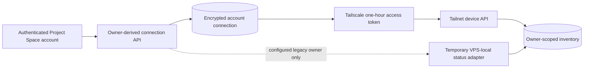

# Tailscale provider connections

Project Space supports account-scoped Tailscale inventory through a Tailscale OAuth client.
This is a control-plane connection: it can read the devices that belong to one tailnet, but it
does not join the Project Space server to that tailnet.

## Supported connection model

Tailscale's stable inventory integration uses an OAuth client created by a tailnet administrator.
It uses the OAuth 2.0 client-credentials grant and requests only `devices:core:read`.
Project Space always calls `tailnet/-/devices`; the credential itself selects its owning tailnet.

There is no general interactive user-consent flow for cross-tailnet inventory. Tailscale's separate
OAuth Apps authorization-code flow is currently intended for same-tailnet device provisioning and
is not used by Project Space.

Official contract references:

- [OAuth clients](https://tailscale.com/docs/features/oauth-clients)
- [Trust credential scopes and revocation](https://tailscale.com/docs/reference/trust-credentials)
- [OAuth Apps](https://tailscale.com/docs/features/oauth-apps)

## Control flow and isolation



The authenticated Clerk subject supplies the owner ID. Browser input cannot select another owner,
connection, tailnet, source, or stored inventory scope. Refresh work and its short coalescing cache
are keyed by owner, so one account's response cannot be reconciled into another account.

The first version supports one active Tailscale connection per Project Space account. Project Space
does not yet have a durable organization membership and role model, so it does not pretend that a
personal connection is organization-owned. A revoked connection keeps only safe status/audit
metadata; its encrypted client ID and secret are cleared.

## Credential lifecycle

- The browser submits a client ID and secret once over the authenticated HTTPS connection.
- Project Space requests only `devices:core:read` and verifies a fresh device-list response before
  saving the connection.
- Both values are stored in one AES-256-GCM envelope using the dedicated deployment key
  `PROJECT_SPACE_PROVIDER_CREDENTIAL_ENCRYPTION_KEY_B64` and the explicit
  `PROJECT_SPACE_PROVIDER_CREDENTIAL_ENCRYPTION_KEY_ID`.
- There is no fallback to the Clerk secret, database URL, source code, or a browser-readable value.
- API access tokens last one hour according to Tailscale and remain in process memory only. Project
  Space does not persist or return them.
- Disconnecting in Project Space immediately removes the encrypted credential material and blocks
  further refresh/classification. A tailnet administrator should also revoke the OAuth client in
  Tailscale so any still-valid access token is revoked at the provider.
- Rotation means creating a replacement OAuth client, verifying and saving it, then revoking the old
  client in Tailscale. Tailscale does not document in-place client-secret rotation.

Provider errors are reduced to stable categories. Plaintext credential values exist only while a
request is being verified or an encrypted connection is being used; they are never persisted
outside the encrypted envelope or returned. Raw Tailscale response bodies, access tokens, device
payloads, and network errors are never persisted or returned.

## Inventory truth

Every explicit refresh requests a new point-in-time device list and stamps server receipt time.
Stable Tailscale device IDs reconcile records. Only validated exact Tailscale IPv4 or IPv6 addresses
are stored; MagicDNS is optional. Online and `lastSeen` evidence come from the API response and are
treated as unknown when the provider is unavailable, revoked, or no longer sufficiently scoped.

The temporary `temporary_vps_local_status` adapter remains for the single production owner until
the replacement is proven. Its identity is visible in the response and UI. It is selected only for
that configured owner when no provider connection record exists; an unrelated or revoked account
never falls back to it.

A clean deployment that uses only account-owned OAuth inventory can omit the host socket and legacy
sidecar with the repository-managed Compose overlay:

```sh
docker compose -f deploy/compose.yml -f deploy/compose.tailscale-oauth.yml up -d --build
```

The current production deployment intentionally continues to use the base Compose file until its
replacement connection and migration are verified.

Before enabling connections in production, the protected GitHub `Production` environment must
contain `PROJECT_SPACE_PROVIDER_CREDENTIAL_ENCRYPTION_KEY_B64` as a generated 32-byte Base64 key
and `PROJECT_SPACE_PROVIDER_CREDENTIAL_ENCRYPTION_KEY_ID` as its non-secret identifier. The
approved deployment job passes those values to the Project CLI, which stores them only in the
protected VPS runtime environment. The application fails closed when either field is absent or
invalid, and the production deployment stops before contacting the VPS when either GitHub secret
is missing. Neither field is needed for the temporary VPS-local adapter.

The named 1Password references in `deploy/deploy.yaml` remain a manual transition fallback until
the planned Infisical migration. The normal GitHub production deployment overrides those two
references with the protected environment secrets and does not resolve them through 1Password.

## Data plane is separate

OAuth API inventory does not provide a route for ping, SSH, development servers, or remote runtime
control. The current repository has no per-connection network worker, secret broker, isolated state
directory, or fail-closed cleanup proof. A shared SOCKS proxy or global userspace daemon would cross
tenant boundaries and is intentionally not part of this change.

- [Issue #733](https://github.com/DotNaos/project-space/issues/733) owns isolated per-connection
  Tailscale data-plane workers, with tsnet as the preferred candidate.
- [Issue #734](https://github.com/DotNaos/project-space/issues/734) owns the WireGuard enrollment,
  key lifecycle, AllowedIPs, NAT, freshness, and isolation design.

Until #733 is proven, the working VPS-local data plane and its bounded SSH operations remain
unchanged. Provider-managed environments such as GitHub Codespaces continue to use their own
provider adapters and do not receive fabricated Hosts.
