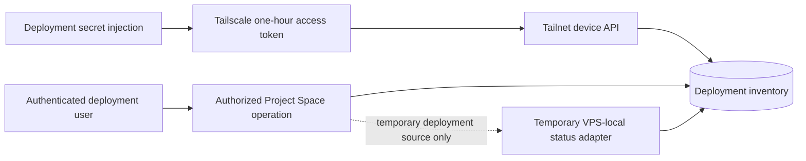

# Tailscale provider connections

Project Space supports deployment-owned Tailscale inventory through one Tailscale OAuth client.
Each Project Space deployment represents one individual or organization infrastructure domain;
the OAuth client belongs to that deployment's tailnet, not to an application user. This is a
control-plane connection: it can read the devices that belong to that tailnet, but it does not
join the Project Space server to the tailnet.

See [Single-tenant deployment ownership](single-tenant-deployment.md) for the overall boundary.

## Supported connection model

Tailscale's stable inventory integration uses an OAuth client created by a tailnet administrator.
It uses the OAuth 2.0 client-credentials grant and requests only `devices:core:read`.
Project Space always calls `tailnet/-/devices`; the credential itself selects its owning tailnet.

There is no general interactive user-consent flow for cross-tailnet inventory. Tailscale's separate
OAuth Apps authorization-code flow is currently intended for same-tailnet device provisioning and
is not used by Project Space.

Official contract references:

- [OAuth clients](https://tailscale.com/docs/features/oauth-clients)
- [Trust credential scopes and revocation](https://tailscale.com/docs/reference/trust-credentials)
- [OAuth Apps](https://tailscale.com/docs/features/oauth-apps)

## Control flow and isolation

Only a member admitted by the deployment's explicit production allowlist can access this surface.
A valid identity-provider session alone is insufficient. Browser input cannot select another
tailnet, credential, or inventory source, and no application user receives the OAuth secret.
Separate organizations use separate Project Space deployments rather than sharing a cross-tenant
connection store.

All admitted users read and classify one deployment-scoped Tailscale inventory. The persistence
key is a fixed internal deployment scope rather than a Clerk user ID; audit records still retain
the real person who changed a classification.

## Credential lifecycle

- The deployment supplies `TAILSCALE_OAUTH_CLIENT_ID` and
  `TAILSCALE_OAUTH_CLIENT_SECRET` to the trusted backend through its secret-delivery path.
- The OAuth client requests only `devices:core:read`; Project Space verifies a fresh device-list
  response before reporting the provider as available.
- Production resolves the two names from its dedicated Infisical Production project during the
  approved deployment transaction. Their values are written only to the protected VPS runtime
  environment and are not available to the browser or normal application storage.
- There is no fallback to the Clerk secret, database URL, source code, browser input, or another
  user's credential.
- The retirement migration revokes legacy per-user connection rows and clears their encrypted
  credential fields. It retains only non-secret audit and lifecycle metadata.
- API access tokens last one hour according to Tailscale and remain in process memory only. Project
  Space does not persist or return them.
- Rotation means adding a replacement value in the deployment secret manager, deploying it,
  verifying fresh inventory, then revoking the old OAuth client in Tailscale. Tailscale does not
  document in-place client-secret rotation.

Provider errors are reduced to stable categories. Plaintext credential values exist only in the
trusted server process and are never returned. Raw Tailscale response bodies, access tokens, device
payloads, and network errors are never persisted or returned.

## Inventory truth

Every explicit refresh requests a new point-in-time device list and stamps server receipt time.
Stable Tailscale device IDs reconcile records. Only validated exact Tailscale IPv4 or IPv6 addresses
are stored; MagicDNS is optional. Online and `lastSeen` evidence come from the API response and are
treated as unknown when the provider is unavailable, revoked, or no longer sufficiently scoped.

The temporary `temporary_vps_local_status` adapter remains only for the current production
deployment until the replacement is proven. Its identity is visible in the response and UI. It is
selected only for the deployment's configured legacy owner when OAuth is absent and can never be
selected by browser input.

The production deployment does not require Tailscale to be installed or authenticated on the host
for inventory. The temporary host-local adapter remains only until the deployment OAuth path has
replacement proof. See [Production deployment](production-deployment.md) for the Infisical runtime
contract.

## Data plane is separate

OAuth API inventory does not provide a route for ping, SSH, development servers, or remote runtime
control. The current repository has no per-connection network worker, secret broker, isolated state
directory, or fail-closed cleanup proof. A shared SOCKS proxy or global userspace daemon would cross
tenant boundaries and is intentionally not part of this change.

- [Issue #733](https://github.com/DotNaos/project-space/issues/733) owns isolated per-connection
  Tailscale data-plane workers, with tsnet as the preferred candidate.
- [Issue #734](https://github.com/DotNaos/project-space/issues/734) owns the WireGuard enrollment,
  key lifecycle, AllowedIPs, NAT, freshness, and isolation design.

Until #733 is proven, the working VPS-local data plane and its bounded SSH operations remain
unchanged. Provider-managed environments such as GitHub Codespaces continue to use their own
provider adapters and do not receive fabricated Hosts.
