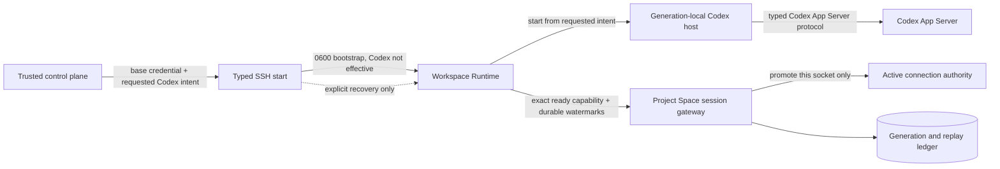

# Workspace Runtime sessions

Workspace Runtime sessions carry live runtime state to Project Space without holding an SSH connection open.

## Authority and startup

The trusted control plane allocates the runtime generation before dispatch. It then issues one short-lived credential bound to:

- the owner and canonical UUID Workspace ID;
- the exact Environment Instance and runtime generation;
- branch, commit, manifest digest, and runtime version;
- an effective telemetry capability set, a separate bounded Codex promotion intent, and expiry of at most one hour.

The issued credential never contains or advertises `runtime.codex.v1`. That capability exists only as
trusted requested intent attached to this exact credential and generation.

The credential is passed through the typed SSH start request into a `0600` bootstrap file in the generation directory. It is never placed in process arguments, command output, runtime events, or a public API result. A failed or mismatched start revokes it.

The WebSocket endpoint is exactly `/api/workspace-runtimes/socket`. Production runtimes require `wss:`. The Go client accepts `ws:` only for a loopback test endpoint.

## Session protocol

The first frame is `runtime.register`. It repeats the immutable Workspace, Environment, generation, source, manifest, and runtime-version evidence. The server compares every field with the authenticated credential before accepting the session.

Subsequent frames have a strictly increasing sequence number and one bounded type:

- lifecycle transitions;
- heartbeat;
- dev-server names, ports, state, and sanitized HTTP(S) URLs;
- bounded CPU and memory telemetry;
- opaque `runtime-log:/…` pointers.

The capability `runtime.codex.v1` enables the bidirectional Codex command channel only after the
generation-local host controller has started the shared Codex executor and successfully initialized
the App Server. Registration must repeat `runtime.codex.v1` as an exact ready capability plus durable
command and event watermarks. The server verifies that this promotion was requested by the same
credential and generation, then adds it only to that active socket. A telemetry-only registration
remains connected without Codex authority, forged or unrequested readiness is rejected, and every
reconnect must present the proof again.

When enabled, server commands and runtime Codex events use independent durable sequences. Every
command remains bound to the authenticated owner, Workspace, Environment, generation, socket
session, originating actor, operation ID, exact target thread, and typed Codex request. Results, approvals, input requests, and
stream events must repeat that binding. Disconnected, stale, stopped, superseded, or mismatched
generations receive no commands. Reconnect registration carries command and event watermarks so
accepted work and stored stream events resume without duplicate mutations.

The Go supervisor starts only the authenticated bundled controller in its dedicated host mode. The
controller communicates through bounded private pipes, exposes no listener, and accepts only the
typed list, read, inspect, continue/steer, interrupt, approval, input, settings, stream, start/status,
and stop contracts. It does not expose shell execution, arbitrary process launch, or file access.
It reuses the same Codex executor, pending approval/input identities, operation ledger, and App Server
lifecycle used by the existing connector path.

The server acknowledges the durable sequence. The runtime journals unacknowledged events in a protected generation-local file and replays them after reconnect. Repeating the exact event ID, sequence, and content is idempotent; changing any part is rejected.

One socket session owns writes at a time. A reconnect replaces and fences the earlier socket. Issuing a new generation revokes the previous credential, supersedes its persisted state, and prevents late events from overwriting the current generation.

## Freshness and failure meaning

Server receive time, not runtime-reported time, controls freshness. The normal heartbeat interval is 15 seconds and the session becomes stale after 45 seconds without a heartbeat. Credential expiry closes the socket. A graceful runtime shutdown sends `stopping` and `stopped`, waits for both acknowledgements, and then closes normally.

A stale or disconnected runtime says only that its outbound runtime channel is unavailable. It never implies that the Host or Environment Instance is offline. Typed SSH inspection remains the explicit recovery path and does not restore write authority to an old generation.

## Security limits

- JSON text frames and stored payloads are capped at 64 KiB.
- Binary frames, query-string credentials, unknown fields, unsafe URLs, arbitrary log URLs, and unsupported capabilities are rejected.
- Credentials are stored only as SHA-256 hashes; raw tokens exist only at issuance and in the protected runtime bootstrap.
- Database transactions and owner/Workspace advisory locks serialize replacement, registration, replay, and event writes.
- The in-memory store is for local development and tests. A configured Project Space database selects the PostgreSQL store.

## Verification boundary

Automated coverage exercises start credential handoff, registration, reconnect/resume, replay, old-socket and old-generation fencing, server-time staleness, capability checks, credential expiry, dev-server publication, graceful stop, protected bootstrap files, and the real WebSocket gateway. PostgreSQL schema and query contracts are exercised without requiring production credentials; production deployment remains gated by pull-request approval and the normal migration checks.
