# Workspace runtimes

Workspace runtimes make repository-specific tools and services reproducible without tying their lifetime to the Git checkout. The checkout remains until a separate worktree operation removes it; runtime `stop`, `reconcile`, and `clean` never delete repository files.

## Runtime manifest

Each participating worktree contains `.project/runtime.yaml`. Version 1 is strict: unknown fields, version ranges, mutable container images, unsupported tool IDs, duplicate declarations, symlinked inputs, and unenforced process limits are rejected.

```yaml
version: 1
defaultMode: process
credentialScope: workspace-generation
projectProtocol: 1
projectRuntime:
  id: project
  version: 0.5.0
  sha256: <exact executable sha256>
codex:
  id: codex
  version: 1.2.3
  sha256: <exact executable sha256>
toolchains:
  - id: bun
    version: 1.2.20
    sha256: <exact executable sha256>
inputs:
  - bun.lock
setup:
  - dependencies
startup: []
shutdown: []
devServers:
  - prototype-desktop
ports:
  - id: prototype
    devServer: prototype-desktop
    protocol: tcp
resources:
  cpuMillis: 0
  memoryMiB: 0
  pids: 0
```

Setup, startup, shutdown, and dev-server names refer to finite declarations in `.project/scripts.yaml`; the runtime manifest cannot introduce free-form shell commands. Process mode currently accepts only zero resource limits because it cannot yet prove cgroup-style enforcement. Devcontainer mode uses a separate strict JSON declaration with a digest-pinned image, a non-root user, `/workspace`, and no mounts, lifecycle hooks, features, host networking, privileged mode, or Docker socket.

## Lifecycle

Use the local CLI against a Project-managed Worktree:

```text
project workspace runtime inspect --json
project workspace runtime start --expected-commit <commit> --expected-digest <digest> --json
project workspace runtime suspend --expected-generation <generation> --json
project workspace runtime resume --expected-generation <generation> --json
project workspace runtime stop --expected-generation <generation> --json
project workspace runtime clean --expected-generation <generation> --json
project workspace runtime reconcile --expected-generation <generation> --json
```

`project worktree prepare` assigns the linked worktree one immutable UUID Workspace ID. That identity survives path moves and is shared with the control plane; recreating the runtime changes only its generation. `start` reuses an already healthy generation only when the Workspace identity, commit, manifest digest, and runtime mode still match. Every mutating follow-up requires the exact generation. A changed or incomplete process, tmux, port, or container observation fails closed.

```mermaid
flowchart LR
  A["Managed Git worktree"] --> B["Strict manifest and pinned tools"]
  B --> C["Persist generation and ownership proof"]
  C --> D["Launch process or container driver"]
  D --> E["Verify every owned resource"]
  E --> F["Running"]
  F --> G["Suspend or stop"]
  G --> H["Re-verify before each mutation"]
  H --> I["Stopped"]
  I --> J["Clean generation state only"]
```



The process driver launches the exact checksum-verified Codex App Server on a private Unix socket whose live owner must remain in the recorded process group. It creates a private HOME and `CODEX_HOME` inside the generation state directory and does not inherit ambient credentials. The container boundary uses an immutable container ID plus exact Workspace, generation, manifest, image, and ownership labels. A container driver is deliberately pluggable; there is no fallback from a requested container runtime to process mode.

The root-owned SSH control-gateway identity can register bounded mappings from a Workspace ID to its Project-managed Worktree. The machine-authenticated HTTP boundary and the pinned private-network SSH transport accept only that ID plus the expected commit, manifest digest, mode, generation, and operation ID. The same authorization and durable replay fence used by `status.v1` protect the runtime operations. The remote gateway invokes the same manager and never accepts caller-selected shell commands or host paths. Public results omit ownership tokens, credentials, logs, and raw provider data.

## Retained archive collector

`clean` deliberately moves a stopped generation out of the active namespace without recursively deleting it. A separate root process can later reclaim that exact retained inode and its historical state snapshots. The collector root must already be a private, root-owned directory outside the Workspace user's state root and on the same filesystem. The collector records the exact source-root, state-directory, and generation-directory identities on first use; a later replacement is rejected.

On macOS, one explicit run looks like:

```text
sudo install -d -m 0700 -o root -g wheel /var/db/project-space/workspace-runtime-retention
sudo project workspace runtime retention status \
  --source-root "$HOME/Library/Application Support/Project Space/workspace-runtimes" \
  --collector-root /var/db/project-space/workspace-runtime-retention --json
sudo project workspace runtime retention collect \
  --source-root "$HOME/Library/Application Support/Project Space/workspace-runtimes" \
  --collector-root /var/db/project-space/workspace-runtime-retention \
  --minimum-age 24h --maximum-bytes 1073741824 --json
```

Linux uses the same commands with the user's state root (normally `~/.local/state/project-space/workspace-runtimes`) and a private root-owned collector directory on the same filesystem. A root-owned system service may schedule the bounded command; an ordinary Workspace process cannot initialize or write the collector boundary.

The collector accepts only a terminal tombstone whose Workspace ID, generation, retained archive name, device/inode proof, state-file inode, and absence evidence still match. It first moves the proven objects into the root-owned staging namespace, reopens the same inodes, transfers their ownership to root, and only then deletes them. A crash leaves a durable intent that resumes from the same proofs. Symlinks, special files, changed roots, duplicate generation evidence, incomplete hardlink groups, active generations, or exceeded age/size bounds cause zero deletion. Receipts and status output contain only opaque identities, counts, timestamps, and byte totals; repository and Worktree paths are never scanned.

## Validation obligations

- If an exact healthy generation is started twice, the second start returns the same generation without launching another runtime.
- If a process, container, socket, dev-server session, state directory, or generation proof is missing, replaced, foreign, or ambiguous, no foreign resource is mutated.
- If a crash happens around a dev-server start or stop, the persisted intent plus the complete Project Serve inventory either reconstructs the exact owned resource or proves it absent; otherwise reconciliation remains blocked.
- If `stop` and `clean` succeed, the generation leaves the active namespace and a bounded, secret-free terminal ownership tombstone records its proof-bound retained archive; no name-based recursive deletion can reach a replacement object. The managed Worktree, its Git metadata, and unrelated processes remain unchanged.
- If the privileged collector succeeds, only the exact retained generation and its complete internal state-snapshot link groups are reclaimed inside the root-owned namespace. A replacement, crash, or ambiguous proof leaves the evidence retained and the checkout unchanged.
- If an SSH request is retried with the same operation ID and bindings, the durable result is replayed without a second dispatch. A changed binding is rejected.

The deterministic proof is split across `go test ./internal/workspacerun ./internal/projectrun`, the race variants of those packages, the SSH control-gateway contract tests, and the database migration tests. `TestRealProcessRuntimeLifecyclePreservesNeighborAndCheckout` is the representative local process-mode run: it builds the current Project CLI, launches the installed pinned Codex App Server, walks start, inspect, suspend, resume, stop, and clean, and checks the neighboring process and checkout afterward. It needs no external secret. A real container engine is optional infrastructure; the provider-neutral container lifecycle and strict digest-pinned fixture remain deterministic contract tests when Docker or Devcontainer is unavailable.
