```mermaid
flowchart LR
  A["Managed Git worktree"] --> B["Strict manifest and pinned tools"]
  B --> C["Persist generation and ownership proof"]
  C --> D["Launch process or container driver"]
  D --> E["Verify every owned resource"]
  E --> F["Running"]
  F --> G["Suspend or stop"]
  G --> H["Re-verify before each mutation"]
  H --> I["Stopped"]
  I --> J["Clean generation state only"]
```

# Workspace runtimes

Workspace runtimes make repository-specific tools and services reproducible without tying their lifetime to the Git checkout. The checkout remains until a separate worktree operation removes it; runtime `stop`, `reconcile`, and `clean` never delete repository files.

## Runtime manifest

Each participating worktree contains `.project/runtime.yaml`. Version 1 is strict: unknown fields, version ranges, mutable container images, unsupported tool IDs, duplicate declarations, symlinked inputs, and unenforced process limits are rejected.

```yaml
version: 1
defaultMode: process
credentialScope: workspace-generation
projectProtocol: 1
projectRuntime:
  id: project
  version: 0.5.0
  sha256: <exact executable sha256>
codex:
  id: codex
  version: 1.2.3
  sha256: <exact executable sha256>
toolchains:
  - id: bun
    version: 1.2.20
    sha256: <exact executable sha256>
inputs:
  - bun.lock
setup:
  - dependencies
startup: []
shutdown: []
devServers:
  - prototype-desktop
ports:
  - id: prototype
    devServer: prototype-desktop
    protocol: tcp
resources:
  cpuMillis: 0
  memoryMiB: 0
  pids: 0
```

Setup, startup, shutdown, and dev-server names refer to finite declarations in `.project/scripts.yaml`; the runtime manifest cannot introduce free-form shell commands. Process mode currently accepts only zero resource limits because it cannot yet prove cgroup-style enforcement. Devcontainer mode uses a separate strict JSON declaration with a digest-pinned image, a non-root user, `/workspace`, and no mounts, lifecycle hooks, features, host networking, privileged mode, or Docker socket.

## Lifecycle

Use the local CLI against a Project-managed Worktree:

```text
project workspace runtime inspect --json
project workspace runtime start --expected-commit <commit> --expected-digest <digest> --json
project workspace runtime suspend --expected-generation <generation> --json
project workspace runtime resume --expected-generation <generation> --json
project workspace runtime stop --expected-generation <generation> --json
project workspace runtime clean --expected-generation <generation> --json
project workspace runtime reconcile --expected-generation <generation> --json
```

`start` reuses an already healthy generation only when the Workspace identity, commit, manifest digest, and runtime mode still match. Every mutating follow-up requires the exact generation. A changed or incomplete process, tmux, port, or container observation fails closed.



The process driver creates a private HOME and `CODEX_HOME` inside the generation state directory and does not inherit ambient credentials. The container boundary uses an immutable container ID plus exact Workspace, generation, manifest, image, and ownership labels. A container driver is deliberately pluggable; there is no fallback from a requested container runtime to process mode.

The next stacked delivery exposes this same manager through typed SSH operations. It must not create a second lifecycle implementation or accept caller-selected shell commands or host paths. Public results omit ownership tokens, credentials, logs, and raw provider data.
